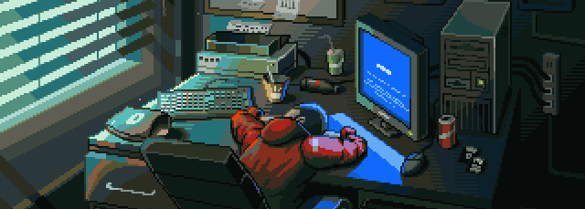

<div align="center">



<br/>

# Ravi Kumar Singh

### `AI Creative Engineer`

> Crafting digital experiences at the intersection of **AI**, **Design**, and **Automation**

<br/>

[](https://github.com/rav-builds)
[](mailto:onlyravi4321@gmail.com)
[](YOUR_LINKEDIN_URL)

<br/>


</div>

---

## 👋 Who I Am

```python
ravi = {
    "role"     : "AI Creative Engineer",
    "building" : "AI-powered Creative Agency",
    "focus"    : ["Brand Identity", "Web Design", "AI Automation", "Social Content"],
    "learning" : ["Business Systems", "Advanced AI", "Full Stack Development"],
    "location" : "Jharkhand, India 🇮🇳",
    "belief"   : "The best digital products come from combining design with systems."
}
```

I help **startups and businesses** build a strong online presence — modern websites, sharp branding, AI-powered workflows, and scalable content systems. My goal is to make creativity feel effortless and technology feel human.

---

## 🚀 Featured Projects

| # | Project | Description | Status |
|---|---------|-------------|--------|
| 01 | 🌐 **AI Creative Agency** | Personal agency website — design + dev | 🚧 Building |
| 02 | 🎨 **Startup Branding** | End-to-end brand identity systems | ✅ Active |
| 03 | 🤖 **AI Automation** | n8n + LLM-powered workflows | 🚀 Growing |
| 04 | 📱 **Social Content Systems** | AI-driven content pipelines for brands | 🎬 Ongoing |

---

## 🛠 Tech Stack

### Languages
<p>

</p>

### Frontend
<p>

</p>

### Design
<p>

</p>

### AI & Automation
| AI | Automation |
|----|------------|
| OpenAI API · Claude · Gemini | n8n · Zapier · Make |
| Prompt Engineering · AI Agents | Workflow Design · API Integrations |

### Dev & Deployment
<p>

</p>

### Creative Tools
`DaVinci Resolve` &nbsp;·&nbsp; `CapCut` &nbsp;·&nbsp; `Canva`

---

## 📊 GitHub Stats

<div align="center">


<br/>


</div>

---

## 🎯 Beyond the Build

When I'm not coding or designing, I'm deep in the creative side of things.

- 🎬 &nbsp;Video editing — cuts, color grading, motion & storytelling
- 🎨 &nbsp;Brand identity — logos, visual systems & design inspiration
- ✂️ &nbsp;Short-form content editing for social media
- 🤖 &nbsp;Experimenting with AI tools & new workflows
- 📚 &nbsp;Learning something new every single week

---

## 📬 Let's Build Something

If you're working on something exciting and need help with **branding**, **web design**, **AI automation**, or **content systems** — I'm open to collaborating.

<div align="center">

[](YOUR_LINKEDIN_URL)
[](mailto:onlyravi4321@gmail.com)
[](https://github.com/rav-builds)

<br/>

---

*Building better digital experiences, one project at a time.*

</div>
